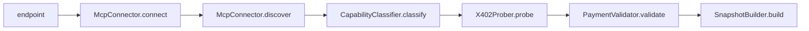

[]() 

# x402-mcp-validator

Validates MCP servers end-to-end: connects via StreamableHTTP or SSE, discovers capabilities, probes each tool for x402 payment requirements, validates payment options against the x402 spec, measures latency, and returns a structured snapshot with 12 boolean categories and 13 entry fields.

## Quickstart

```bash
git clone https://github.com/FlowMCP/x402-mcp-validator.git
cd x402-mcp-validator
npm i
```

```javascript
import { McpServerValidator } from 'x402-mcp-validator'

const { status, messages, categories, entries } = await McpServerValidator.start( {
    endpoint: 'https://your-mcp-server.example.com/mcp',
    timeout: 15000
} )
```

## Features

- Connects to MCP servers via StreamableHTTP with SSE fallback
- Discovers tools, resources, prompts, and capabilities
- Probes each tool for x402 payment requirements (HTTP 402 / JSON-RPC -32402)
- Validates payment options: scheme, network, amount, asset, payTo, checksums
- Classifies 12 boolean categories (reachable, MCP, x402, EVM, Solana, tasks, mcpApps)
- Measures ping and listTools latency
- Compares two snapshots and produces a structured diff
- Returns empty snapshot with all-false categories on connection failure

## Architecture

The validation pipeline processes an MCP server in six sequential steps:



## Table of Contents

- [Methods](#methods)
  - [.start()](#start)
  - [.compare()](#compare)
- [Categories](#categories)
- [Entries](#entries)
- [License](#license)

## Methods

All methods are static. Parameters are passed as objects, return values are objects.

### `.start()`

Connects to an MCP server, discovers capabilities, probes for x402 payment support, validates payment requirements, measures latency, and returns a structured snapshot.

**Method**

```
.start( { endpoint, timeout } )
```

| Key | Type | Description | Required |
|-----|------|-------------|----------|
| endpoint | string | URL of the MCP server. Example `'https://server.example.com/mcp'` | Yes |
| timeout | number | Connection timeout in milliseconds. Default `10000` | No |

**Example**

```javascript
import { McpServerValidator } from 'x402-mcp-validator'

const { status, messages, categories, entries } = await McpServerValidator.start( {
    endpoint: 'https://your-mcp-server.example.com/mcp',
    timeout: 15000
} )

console.log( `Status: ${status ? 'PASS' : 'FAIL'}` )
console.log( `Tools: ${entries['tools'].length}` )
console.log( `x402: ${categories['supportsX402']}` )
console.log( `Networks: ${JSON.stringify( entries['x402']['networks'] )}` )
```

**Returns**

```javascript
{ status, messages, categories, entries }
```

| Key | Type | Description |
|-----|------|-------------|
| status | boolean | `true` when no messages were generated |
| messages | array of strings | Warning and error messages with error codes |
| categories | object | 12 boolean flags (see [Categories](#categories)) |
| entries | object | 13 data fields (see [Entries](#entries)) |

---

### `.compare()`

Compares two snapshots produced by `.start()` and returns a structured diff with added, removed, and modified items per section.

**Method**

```
.compare( { before, after } )
```

| Key | Type | Description | Required |
|-----|------|-------------|----------|
| before | object | Snapshot from a previous `.start()` call. Must contain `categories` and `entries` | Yes |
| after | object | Snapshot from a later `.start()` call. Must contain `categories` and `entries` | Yes |

**Example**

```javascript
import { McpServerValidator } from 'x402-mcp-validator'

const before = await McpServerValidator.start( { endpoint: 'https://server.example.com/mcp' } )
const after = await McpServerValidator.start( { endpoint: 'https://server.example.com/mcp' } )

const { status, messages, hasChanges, diff } = McpServerValidator.compare( { before, after } )

console.log( `Changes detected: ${hasChanges}` )
console.log( `Tools added: ${diff['tools']['added'].length}` )
console.log( `Tools removed: ${diff['tools']['removed'].length}` )
```

**Returns**

```javascript
{ status, messages, hasChanges, diff }
```

| Key | Type | Description |
|-----|------|-------------|
| status | boolean | `true` when comparison completed |
| messages | array of strings | Integrity warnings (URL mismatch, timestamp issues) |
| hasChanges | boolean | `true` when any diff section has changes |
| diff | object | Structured diff with sections: `server`, `capabilities`, `tools`, `x402`, `latency`, `categories` |

## Categories

12 boolean flags returned in `categories`:

| Key | Description |
|-----|-------------|
| isReachable | Server responded to HEAD request |
| supportsMcp | MCP handshake completed |
| hasTools | Server exposes at least one tool |
| hasResources | Server exposes at least one resource |
| hasPrompts | Server exposes at least one prompt |
| supportsX402 | At least one tool returned a 402 payment error |
| hasValidPaymentRequirements | At least one payment option passed validation |
| supportsExactScheme | Has payment options with `scheme: 'exact'` |
| supportsEvm | Has payment options with `network: 'eip155:*'` |
| supportsSolana | Has payment options with `network: 'solana:*'` |
| supportsTasks | Server advertises tasks capability |
| supportsMcpApps | Server advertises mcpApps capability |

## Entries

13 data fields returned in `entries`:

| Key | Type | Description |
|-----|------|-------------|
| endpoint | string | MCP server endpoint URL that was validated |
| serverName | string | Server name from MCP handshake |
| serverVersion | string | Server version |
| serverDescription | string | Server description |
| protocolVersion | string | MCP protocol version |
| capabilities | object | Raw server capabilities |
| instructions | string | Server instructions |
| tools | array | Discovered tools with name, description, inputSchema |
| resources | array | Discovered resources |
| prompts | array | Discovered prompts |
| x402 | object | Payment data: `version`, `restrictedCalls`, `paymentOptions`, `networks`, `schemes`, `perTool` |
| latency | object | `ping` and `listTools` in milliseconds |
| timestamp | string | ISO 8601 timestamp of validation |

## Validation Codes

### VAL — Input Validation

| Code | Severity | Description |
|------|----------|-------------|
| VAL-001 | ERROR | endpoint: Missing value |
| VAL-002 | ERROR | endpoint: Must be a string |
| VAL-003 | ERROR | endpoint: Must not be empty |
| VAL-004 | ERROR | endpoint: Must be a valid URL |
| VAL-005 | ERROR | timeout: Must be a number |
| VAL-006 | ERROR | timeout: Must be greater than 0 |
| VAL-010 | ERROR | before: Missing value |
| VAL-011 | ERROR | before: Must be an object |
| VAL-012 | ERROR | before: Missing categories or entries |
| VAL-013 | ERROR | after: Missing value |
| VAL-014 | ERROR | after: Must be an object |
| VAL-015 | ERROR | after: Missing categories or entries |

### CON — MCP Connection

| Code | Severity | Description |
|------|----------|-------------|
| CON-001 | ERROR | endpoint: Server is not reachable |
| CON-004 | ERROR | mcp: Initialize handshake failed |
| CON-008 | WARNING | tools/list: Request failed |
| CON-009 | WARNING | tools/list: Invalid response format |
| CON-010 | INFO | resources/list: Request failed |
| CON-011 | INFO | prompts/list: Request failed |

### PAY — Payment Validation

| Code | Severity | Description |
|------|----------|-------------|
| PAY-001 | ERROR | restrictedCalls: PaymentRequired data is missing |
| PAY-002 | ERROR | restrictedCalls: PaymentRequired is not an object |
| PAY-010 | ERROR | x402Version: Missing required field |
| PAY-011 | ERROR | x402Version: Must be a number |
| PAY-012 | ERROR | x402Version: Expected 2 |
| PAY-020 | ERROR | resource: Must be a string or object |
| PAY-021 | ERROR | resource: Must not be empty / resource.url: Missing value |
| PAY-022 | ERROR | resource.url: Must be a string |
| PAY-023 | ERROR | resource.url: Invalid URL format |
| PAY-024 | ERROR | resource: Unknown field |
| PAY-030 | ERROR | accepts: Missing required field |
| PAY-031 | ERROR | accepts: Must be an array |
| PAY-032 | ERROR | accepts: Is empty array |
| PAY-040 | ERROR | scheme: Missing value |
| PAY-041 | ERROR | scheme: Must be a string |
| PAY-042 | ERROR | scheme: Invalid value |
| PAY-050 | ERROR | network: Missing value |
| PAY-051 | ERROR | network: Must be a string |
| PAY-052 | ERROR | network: Unknown prefix |
| PAY-053 | ERROR | network: Missing chain ID after prefix |
| PAY-060 | ERROR | maxAmountRequired: Missing value |
| PAY-061 | ERROR | maxAmountRequired: Must be a string |
| PAY-062 | ERROR | maxAmountRequired: Must be a numeric string |
| PAY-063 | ERROR | maxAmountRequired: Must be positive |
| PAY-070 | ERROR | asset: Missing value |
| PAY-071 | ERROR | asset: Must be a string |
| PAY-072 | ERROR | asset: Invalid EVM address format |
| PAY-080 | ERROR | payTo: Missing value |
| PAY-081 | ERROR | payTo: Must be a string |
| PAY-082 | ERROR | payTo: Invalid EVM address format |
| PAY-083 | WARNING | payTo: Not checksummed |
| PAY-090 | ERROR | maxTimeoutSeconds: Missing value |
| PAY-091 | ERROR | maxTimeoutSeconds: Must be a number |
| PAY-092 | ERROR | maxTimeoutSeconds: Must be greater than 0 |
| PAY-100 | INFO | extra: Must be an object |
| PAY-101 | INFO | extra.name: Missing (recommended for EVM) |
| PAY-102 | INFO | extra.version: Missing (recommended for EIP-3009) |

### PRB — Probe

| Code | Severity | Description |
|------|----------|-------------|
| PRB-004 | INFO | probe: Unexpected exception |
| PRB-005 | INFO | probe: No tools available to probe |

### AUTH — OAuth

| Code | Severity | Description |
|------|----------|-------------|
| AUTH-002 | INFO | Authorization Server Metadata not found or incomplete |
| AUTH-003 | INFO | PKCE S256 not supported (MCP Spec MUST) |
| AUTH-004 | INFO | Missing authorization_servers in Protected Resource Metadata |
| AUTH-005 | INFO | No client registration mechanism available |
| AUTH-010 | INFO | Server requires authentication |
| AUTH-011 | INFO | Scopes found |

### CMP — Comparison

| Code | Severity | Description |
|------|----------|-------------|
| CMP-001 | WARNING | Snapshots are from different servers |
| CMP-002 | WARNING | Before snapshot has no timestamp |
| CMP-003 | WARNING | After snapshot is older than before |

## License

MIT
